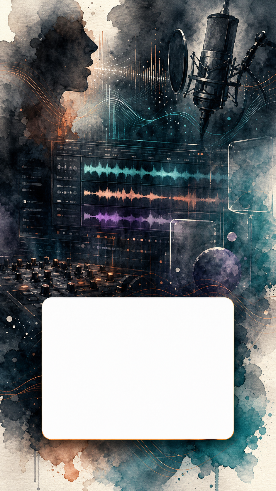

# 🤖 Studio Noir - OmniVoice Playground Standalone

[**English**](#english) | [**Tiếng Việt**](#tiếng-việt)

---

<a name="english"></a>
## 🇺🇸 English

Welcome to **Studio Noir - OmniVoice Playground**, a premium, high-fidelity standalone speech synthesis interface and automated audio-video orchestration sandbox built on top of the next-generation **k2-fsa/OmniVoice** model.

This playground provides a powerful, interactive visual dashboard to experiment with state-of-the-art text-to-speech (TTS) features, including instruct-guided generation and high-fidelity voice cloning, featuring an integrated DAW-like timeline interface.

---

### 🌟 Key Features

* **Dual Inference Modes:**
  * **Instruct Mode:** Guide the voice style, pitch, gender, and age using natural language descriptors (e.g., `"female, young adult, high pitch, excited"`).
  * **Cloning Mode:** Clone any target voice instantly by uploading a short reference audio file (supports `.wav`, `.mp3`) along with optional reference transcripts.
* **Interactive DAW Timeline Simulation:** Visualize soundwave grids, edit clips, adjust speed/guidance scale, and manage audio tracks with modular drag-and-drop aesthetics.
* **Intelligent CUDA Hardware Acceleration:** Auto-detects NVIDIA GPUs (e.g., GeForce RTX 40-series) and loads the model weights with FP16 precision using optimized PyTorch + CUDA wheels for lightning-fast real-time speech generation.
* **Mock Sandboxing Fallback:** Runs instantly in **Mock Mode** if PyTorch or GPU resources are missing, allowing web designers and developers to test UI layout, timelines, and dashboard aesthetics without downloading large models.

---

### 🛠️ Technology Stack

* **Frontend:** React 18, Vite, TypeScript, TailwindCSS v4, Lucide Icons, glassmorphism-based cinematic UI system.
* **Backend:** FastAPI (Python), Uvicorn (ASGI web server), PyTorch (CUDA accelerated), Torchaudio, HuggingFace Hub, OmniVoice.

---

### 📦 System Requirements

* **Node.js:** v18.0.0 or higher (for compiling the frontend React assets).
* **Python:** v3.10.x or v3.12.x (Recommended: **Python 3.12** for stable prebuilt PyTorch CUDA wheels).
* **GPU (Optional):** NVIDIA GPU with CUDA 12.1+ support for hardware-accelerated speech synthesis.

---

### 🚀 Quick Start (Windows Launcher)

The repository contains an automated launcher script `run.bat` that handles system verification, installs Python virtual environments, downloads dependencies, compiles frontend code, and boots the servers automatically.

1. Double-click **`run.bat`** (or execute it via CMD):
   ```cmd
   .\run.bat
   ```
2. The script will automatically:
   * Scan your machine for Python 3.12 or 3.10.
   * Initialize a virtual environment (`backend\.venv`).
   * Install/upgrade package managers.
   * Download and install the correct CUDA-compiled PyTorch & Torchaudio dependencies if an NVIDIA GPU is present.
   * Install React dependencies and compile production-grade Vite assets inside `frontend\dist`.
   * Boot the FastAPI server and open **`http://localhost:8000`** in your browser.

---

### ⚡ CUDA GPU Acceleration Troubleshooting (NVIDIA RTX)

If you have an NVIDIA GPU but the system defaults to CPU, ensure you configure matching PyTorch and Torchaudio builds:

1. Rebuild your virtual environment using **Python 3.12**.
2. Install the CUDA-compiled PyTorch wheel:
   ```cmd
   backend\.venv\Scripts\pip install torch --index-url https://download.pytorch.org/whl/cu121
   ```
3. Install the matching CUDA-compiled Torchaudio wheel (mismatched versions will trigger DLL loading errors):
   ```cmd
   backend\.venv\Scripts\pip install torchaudio==2.5.1+cu121 --index-url https://download.pytorch.org/whl/cu121
   ```
4. Reinstall remaining dependencies:
   ```cmd
   backend\.venv\Scripts\pip install -r backend/requirements.txt
   ```

---

### 📁 Directory Structure

```text
omnivoiceplayground/
├── backend/                  # FastAPI Backend API & ML Model Loader
│   ├── .venv/                # Isolated Python Virtual Environment
│   ├── audio_generator.py    # OmniVoice Model wrapper (CUDA/CPU device mapping)
│   ├── main.py               # Main FastAPI server entry point
│   ├── requirements.txt      # Python dependencies list
│   └── state.py              # Application state and caching layer
├── frontend/                 # React + TypeScript Frontend
│   ├── src/                  # React components & UI views
│   │   ├── components/       # Premium layout, modals, and charts
│   │   ├── main.tsx          # Frontend entry point
│   │   └── index.css         # Styling system
│   └── dist/                 # Production-compiled web assets
├── run.bat                   # Windows automated launcher script
├── run.sh                    # Linux/macOS automated launcher script
└── README.md                 # Project handbook
```

---

## Project Visuals And Support

The project includes watercolor-style graphics inspired by the README themes:
OmniVoice text-to-speech, voice cloning, DAW-style timelines, waveform grids,
CUDA acceleration, and the Studio Noir cinematic interface mood.

All visual assets live in:

```text
frontend/public/donate-graphics/
```

### Watercolor README Visuals

| Format | Preview | File |
| --- | --- | --- |
| Portrait voice studio |  | `portrait-voice-studio-watercolor-bg.png` |
| Square voice cloning |  | `square-voice-clone-watercolor-bg.png` |
| Landscape audio orchestration |  | `banner-audio-orchestration-watercolor-bg.png` |

### Support The Project

If this playground helps your voice synthesis experiments, you can support the
project with the standalone VietQR donate card.


- Donate QR card file: `frontend/public/donate-graphics/vietqr-donate-card.png`
- Technology references and asset notes: `frontend/public/donate-graphics/REFERENCES.md`

The QR card is kept as a separate image so the watercolor visuals can decorate
the README without turning every artwork into a donate poster.

### Technology References

- **OmniVoice** by `k2-fsa` - core text-to-speech and voice cloning model used by the playground.
- **PyTorch** by the PyTorch Foundation / Linux Foundation - tensor runtime and CUDA acceleration layer.
- **FastAPI** by the FastAPI open-source project - Python API server for inference endpoints.
- **React** by Meta and **Vite** by the Vite open-source project - frontend app and development build system.
- **Tailwind CSS** by Tailwind Labs and **Lucide** by the Lucide open-source project - interface styling and icon system.

---
---

<a name="tiếng-việt"></a>
## 🇻🇳 Tiếng Việt

Chào mừng bạn đến với **Studio Noir - OmniVoice Playground**, giao diện thử nghiệm giọng nói nhân tạo cao cấp và là hộp cát tự động hóa phối hợp âm thanh - video điện ảnh được xây dựng dựa trên mô hình thế hệ mới **k2-fsa/OmniVoice**.

Playground này cung cấp một bảng điều khiển tương tác trực quan cao cấp giúp bạn thử nghiệm các tính năng chuyển văn bản thành giọng nói (TTS) hiện đại nhất, bao gồm hướng dẫn giọng nói bằng ngôn ngữ tự nhiên (Instruct) và nhân bản giọng nói chất lượng cao (Cloning), đi kèm giao diện mô phỏng dòng thời gian DAW chuyên nghiệp.

---

### 🌟 Tính năng nổi bật

* **Hai chế độ suy luận linh hoạt:**
  * **Instruct Mode (Hướng dẫn):** Điều khiển phong cách, cao độ, giới tính và độ tuổi giọng nói thông qua các mô tả ngôn ngữ tự nhiên (ví dụ: `"female, young adult, high pitch, excited"`).
  * **Cloning Mode (Nhân bản):** Sao chép tức thì bất kỳ giọng nói nào bằng cách tải lên file âm thanh tham chiếu ngắn (hỗ trợ `.wav`, `.mp3`) cùng văn bản tham chiếu tùy chọn.
* **Giao diện dòng thời gian DAW trực quan:** Mô phỏng các dải sóng âm, chỉnh sửa clip, thay đổi tốc độ/tỷ lệ định hướng và quản lý các track nhạc với thiết kế kéo thả dạng mô-đun đẹp mắt.
* **Tự động tăng tốc phần cứng CUDA:** Tự động phát hiện GPU NVIDIA (ví dụ: GeForce RTX 40-series) và tải trọng số mô hình với độ chính xác FP16 bằng thư viện PyTorch + CUDA đã tối ưu giúp sinh giọng nói thời gian thực siêu nhanh.
* **Chế độ Mock chạy độc lập:** Tự động chuyển sang **Mock Mode** giả lập nếu máy không cài sẵn PyTorch hoặc thiếu GPU. Giúp các nhà thiết kế và phát triển web kiểm thử nhanh giao diện, dòng thời gian DAW mà không cần chờ tải model nặng (~1.2 GB).

---

### 🛠️ Công nghệ sử dụng

* **Frontend:** React 18, Vite, TypeScript, TailwindCSS v4, Lucide Icons, hệ thống giao diện tối giản phong cách điện ảnh (cinematic glassmorphism).
* **Backend:** FastAPI (Python), Uvicorn (ASGI web server), PyTorch (tăng tốc CUDA), Torchaudio, HuggingFace Hub, OmniVoice.

---

### 📦 Yêu cầu hệ thống

* **Node.js:** Phiên bản v18.0.0 trở lên (để biên dịch mã nguồn React).
* **Python:** Phiên bản v3.10.x hoặc v3.12.x (Khuyên dùng: **Python 3.12** để cài đặt thư viện PyTorch CUDA ổn định nhất).
* **GPU (Tùy chọn):** Card đồ họa NVIDIA hỗ trợ CUDA 12.1+ để kích hoạt tăng tốc sinh giọng nói bằng phần cứng.

---

### 🚀 Hướng dẫn khởi chạy nhanh (Windows Launcher)

Thư mục dự án đi kèm file script tự động **`run.bat`** giúp kiểm tra hệ thống, khởi tạo môi trường ảo Python, tải thư viện dependencies, biên dịch frontend và kích hoạt server hoàn toàn tự động.

1. Nhấp đúp chuột vào file **`run.bat`** (hoặc chạy trong cửa sổ CMD):
   ```cmd
   .\run.bat
   ```
2. Script sẽ tự động thực hiện:
   * Quét và tìm kiếm Python 3.12 hoặc 3.10 trên máy tính của bạn.
   * Khởi tạo môi trường ảo Python cô lập (`backend\.venv`).
   * Cập nhật công cụ quản lý thư viện (`pip`).
   * Tự động cài đặt đúng gói PyTorch & Torchaudio có tăng tốc CUDA nếu phát hiện có card đồ họa NVIDIA.
   * Cài đặt gói thư viện Node.js và biên dịch mã nguồn React sang thư mục sản phẩm `frontend\dist`.
   * Khởi động FastAPI server và tự động mở trình duyệt truy cập địa chỉ: **`http://localhost:8000`**.

---

### ⚡ Khắc phục lỗi không nhận GPU CUDA (Dành cho NVIDIA RTX)

Nếu máy bạn có GPU NVIDIA mạnh nhưng hệ thống vẫn báo chạy trên CPU, hãy đảm bảo cài đặt đồng bộ hai phiên bản PyTorch và Torchaudio CUDA:

1. Xây dựng môi trường ảo mới bằng phiên bản **Python 3.12**.
2. Cài đặt gói PyTorch CUDA 12.1:
   ```cmd
   backend\.venv\Scripts\pip install torch --index-url https://download.pytorch.org/whl/cu121
   ```
3. Cài đặt gói Torchaudio khớp chính xác phiên bản CUDA 12.1 (nếu lệch phiên bản sẽ gây lỗi nạp DLL trên Windows):
   ```cmd
   backend\.venv\Scripts\pip install torchaudio==2.5.1+cu121 --index-url https://download.pytorch.org/whl/cu121
   ```
4. Cài đặt các thư viện còn lại:
   ```cmd
   backend\.venv\Scripts\pip install -r backend/requirements.txt
   ```

---

### 📁 Cấu trúc thư mục

```text
omnivoiceplayground/
├── backend/                  # FastAPI Backend API & ML Model Loader
│   ├── .venv/                # Môi trường ảo Python cô lập
│   ├── audio_generator.py    # Wrapper quản lý mô hình OmniVoice (Tự động map thiết bị CUDA/CPU)
│   ├── main.py               # File chạy chính của FastAPI Server
│   ├── requirements.txt      # Danh sách thư viện Python cần cài đặt
│   └── state.py              # Quản lý trạng thái và bộ nhớ đệm
├── frontend/                 # React + TypeScript Frontend
│   ├── src/                  # Mã nguồn giao diện React
│   │   ├── components/       # Các components giao diện cao cấp, modal, biểu đồ
│   │   ├── main.tsx          # Điểm khởi chạy của Frontend
│   │   └── index.css         # Hệ thống định kiểu CSS toàn cục
│   └── dist/                 # Mã nguồn web đã được biên dịch hoàn chỉnh
├── run.bat                   # Script khởi chạy tự động trên Windows
├── run.sh                    # Script khởi chạy tự động trên Linux/macOS
└── README.md                 # Sách hướng dẫn dự án
```
